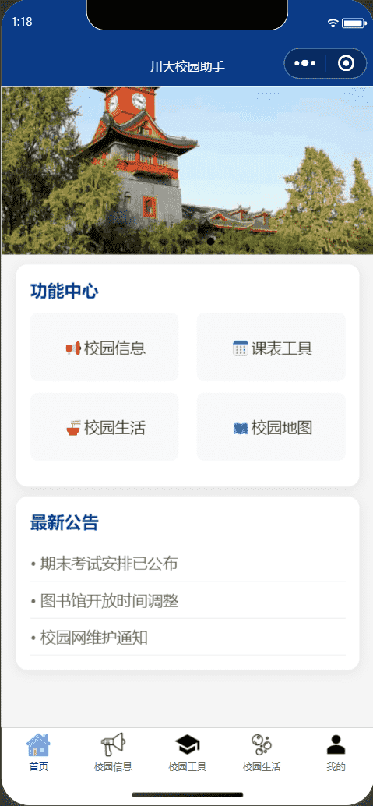
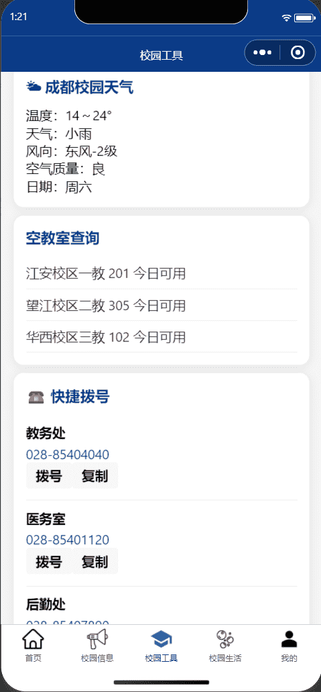
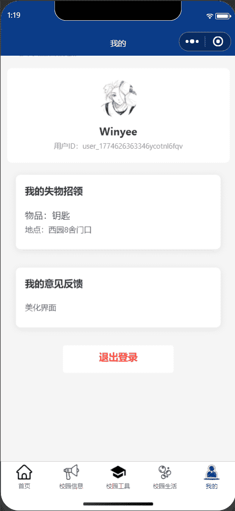

# 🏫 四川大学校园助手小程序

<p align="center">


</p>

<p align="center">
四川大学一站式校园服务小程序，为川大师生提供便捷的校园生活工具
</p>

## 📸 项目预览

<table style="width: 100%; border-collapse: collapse; text-align: center; border: 1px solid #eee;">
  <!-- 图片行 -->
  <tr>
    <td style="width: 33%; padding: 8px; border: 1px solid #eee;">
      
    </td>
    <td style="width: 33%; padding: 8px; border: 1px solid #eee;">
      
    </td>
    <td style="width: 33%; padding: 8px; border: 1px solid #eee;">
      
    </td>
  </tr>
  <!-- 标题行 -->
  <tr>
    <td style="padding: 10px; border: 1px solid #eee; font-size: 16px;">首页</td>
    <td style="padding: 10px; border: 1px solid #eee; font-size: 16px;">校园工具</td>
    <td style="padding: 10px; border: 1px solid #eee; font-size: 16px;">个人中心页</td>
  </tr>
</table>

## ✨ 功能清单

### 核心功能

- 🌤️ 成都实时天气查询：自动获取成都天气，包含温度、天气状况、风向等信息
- 🏫 校园空教室查询：支持江安、望江、华西三校区空教室实时查询
- 🗺️ 川大校园地图导航：集成校园地图，方便查找教学楼、图书馆等地点
- 👤 个人中心 / 登录功能：支持用户登录，保存个人信息
- 📢 校园公告栏：展示最新校园公告，支持点击查看详情
- 
### 实用工具

- 📅 课表查询：快速查看个人课程表
- 📞 快捷拨号：集成教务处、医务室、后勤处等常用电话
- 📦 失物招领：发布和查看失物招领信息
- 💬 意见反馈：提交使用意见和建议
- 
### 🛠️ 技术栈
- 前端框架：微信小程序原生开发
- 天气 API：免费第三方天气 API
- 数据存储：微信小程序本地存储
- UI 设计：自定义组件 + 微信原生组件

## 📱 快速开始

### 环境要求

- 微信开发者工具
- 微信小程序账号（可选，用于真机调试）

### 安装步骤

#### 1. 克隆项目

```bash
git clone https://github.com/你的用户名/仓库名.git
```

#### 2. 打开项目

- 打开微信开发者工具
- 选择「导入项目」
- 选择项目目录，填写 AppID（测试可使用测试号）

#### 3. 配置说明

- 若使用天气 API，可在 ```pages/tool/tool.js``` 中替换为自己的 API 密钥
- 测试阶段可在微信开发者工具中勾选「不校验合法域名、web-view（业务域名）、TLS 版本以及 HTTPS 证书」
- 
#### 4. 运行项目

- 点击「编译」即可在模拟器中查看效果
- 点击「预览」可扫码在手机上真机调试
 
## 📂 项目结构

```plaintext
scu-campus-miniprogram/
├── pages/                  # 页面目录
│   ├── index/             # 首页
│   ├── info/              # 校园信息页
│   ├── tool/              # 校园工具页
│   ├── life/              # 校园生活页
│   ├── map/               # 校园地图页
│   ├── me/                # 个人中心页
│   └── noticeDetail/      # 公告详情页
├── images/                # 图片资源
│   └── preview/           # 预览图
├── app.js                 # 小程序入口文件
├── app.json               # 小程序配置文件
├── app.wxss               # 全局样式文件
└── README.md              # 项目说明文档
```

## 🤝 贡献指南

欢迎任何形式的贡献！如果你有好的想法或发现了 bug，欢迎：
1. Fork 本仓库
2. 创建新的分支 (```git checkout -b feature/AmazingFeature```)
3. 提交你的更改 (```git commit -m 'Add some AmazingFeature'```)
4. 推送到分支 (```git push origin feature/AmazingFeature```)
5. 开启一个 Pull Request
📄 许可证
本项目采用 MIT 许可证 - 查看 [LICENSE](MIT) 文件了解详情

## 🙏 致谢

感谢四川大学提供的校园服务支持
感谢免费天气 API 提供的数据支持
感谢所有为本项目做出贡献的开发者

<p align="center">
Made with ❤️ by 川大师生
</p>
